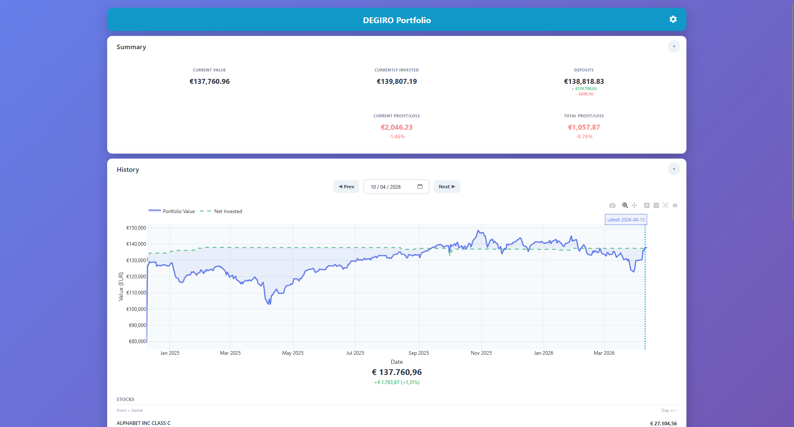
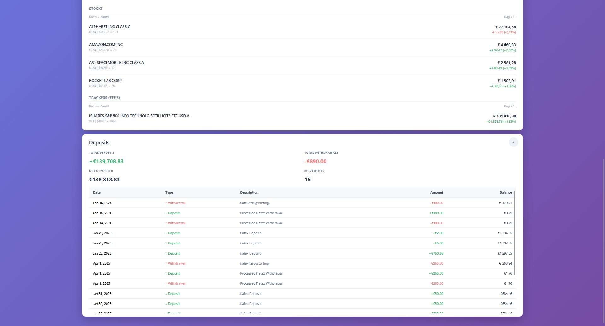
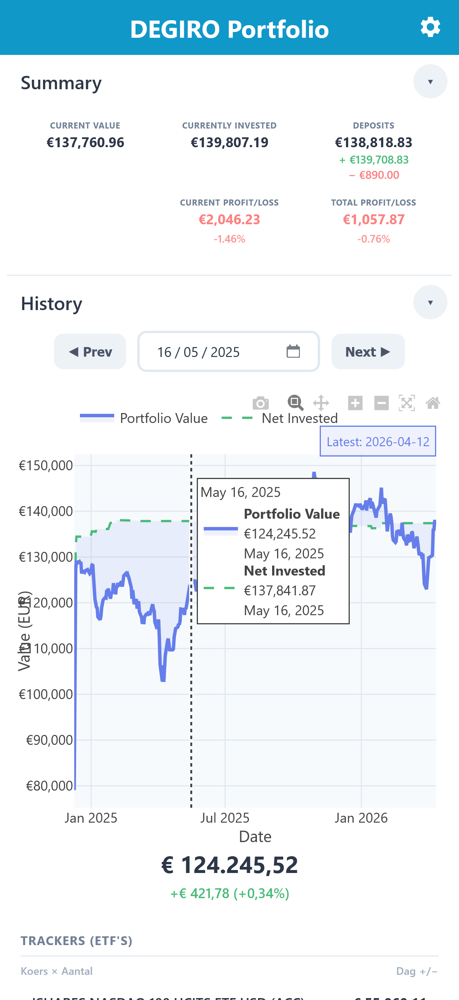
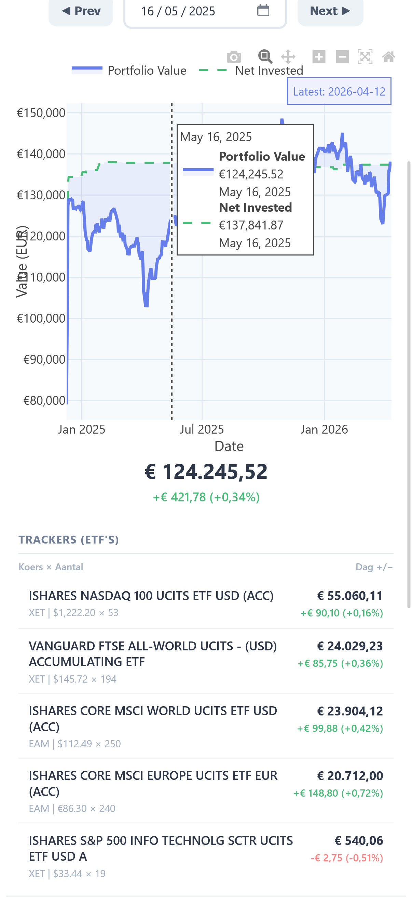
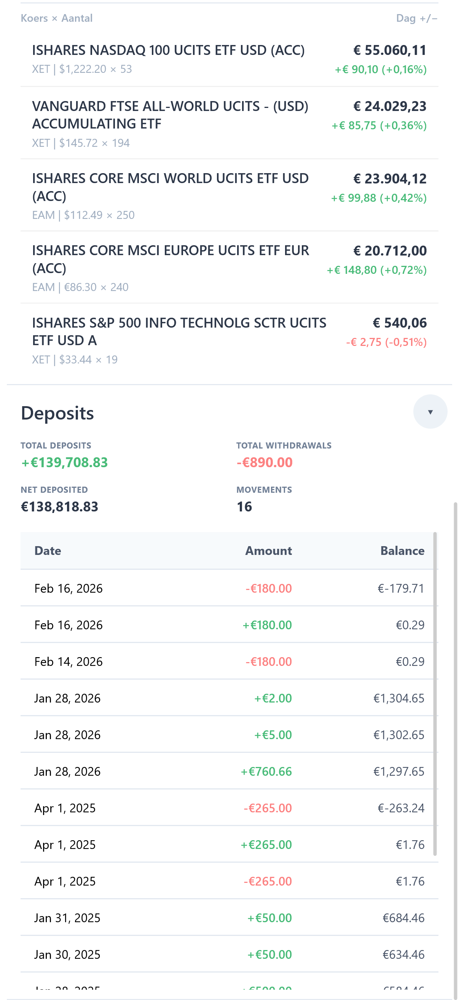

# DEGIRO Portfolio History

DEGIRO Portfolio History imports DEGIRO account exports and stores transaction and market history in a local SQLite database. It provides a web interface to review holdings, price history, and portfolio performance over time.

## Installation

Run the app with Docker Compose:

```yaml
degiro-portfolio-history:
  image: taltiko/degiro-portfolio-history:latest
  ports:
    - 8000:8000
  volumes:
    - <database-folder>:/config
```

Replace `<database-folder>` with a local folder path where you want the database to be persisted.

## Import Data

The app expects two Excel files from DEGIRO:

1. Account statement extract: contains deposits, withdrawals, and other cash movements.
2. Transactions extract: contains buy and sell transactions.

### 1) Export account statement extract from DEGIRO

1. Sign in to DEGIRO, go to Reports → Account statement.
2. Select your desired date range.
3. Export as Excel (.xlsx)
4. Upload via gear icon => "Upload account statement".

### 2) Export transactions extract from DEGIRO

1. Sign in to DEGIRO, go to Reports → Transactions.
2. Select your desired date range.
3. Export as Excel (.xlsx)
4. Upload via gear icon => "Upload transactions".

Tip: when importing for the first time, upload both files using the same full date range so transaction history and cash movements are aligned.

## Preview

### Desktop screenshots




### Mobile screenshots



